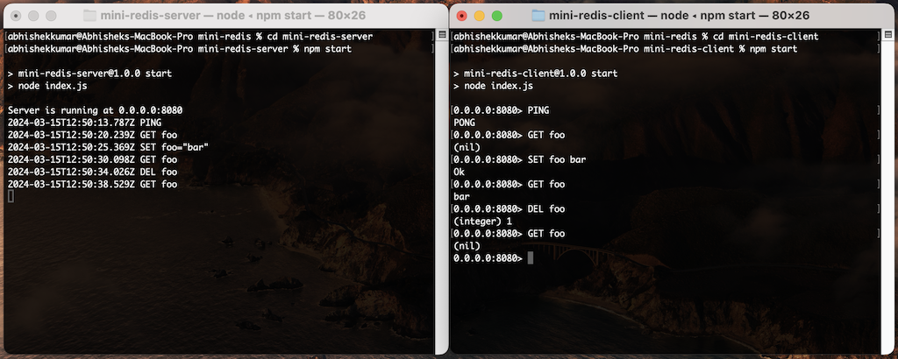
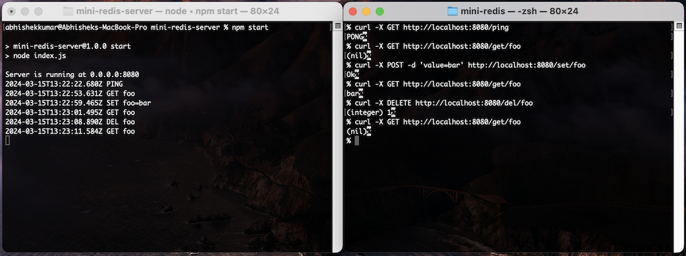

# mini-redis

A lightweight in-memory data store server with a CLI client with interactive mode.

## Getting started

Follow these steps to use mini-redis:

- **Start the server**: Refer to the mini-redis server [README](./mini-redis-server/README.md) for detailed instructions.
- **Use the client**: Access the client instructions in the mini-redis client [README](./mini-redis-client/README.md).

## Demo snapshots

Mini-redis server interaction with CLI client

Mini-redis server interaction using `curl` command

